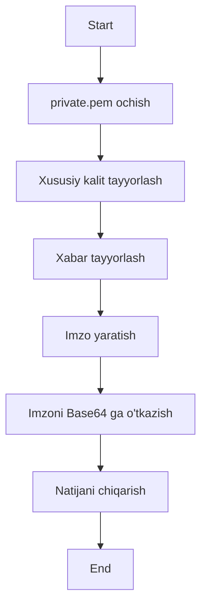
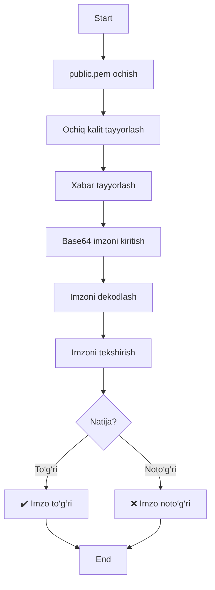

Imzoni yaratish blok sxemasi 

```mermaid
graph TD
    A1[Start] --> B1[private.pem ochish]
    B1 --> C1[Xususiy kalit tayyorlash]
    C1 --> D1[Xabar tayyorlash]
    D1 --> E1[Imzo yaratish]
    E1 --> F1[Imzoni Base64 ga o'tkazish]
    F1 --> G1[Natijani chiqarish]
    G1 --> H1[End]

```
Imzoni tekshirish blok sxemasi

```mermaid
graph TD
    A2[Start] --> B2[public.pem ochish]
    B2 --> C2[Ochiq kalit tayyorlash]
    C2 --> D2[Xabar tayyorlash]
    D2 --> E2[Base64 imzoni kiritish]
    E2 --> F2[Imzoni dekodlash]
    F2 --> G2[Imzoni tekshirish]
    G2 --> H2{Natija?}
    H2 -->|To‘g‘ri| I2[✔️ Imzo to‘g‘ri]
    H2 -->|Noto‘g‘ri| J2[❌ Imzo noto‘g‘ri]
    I2 --> K2[End]
    J2 --> K2
```

